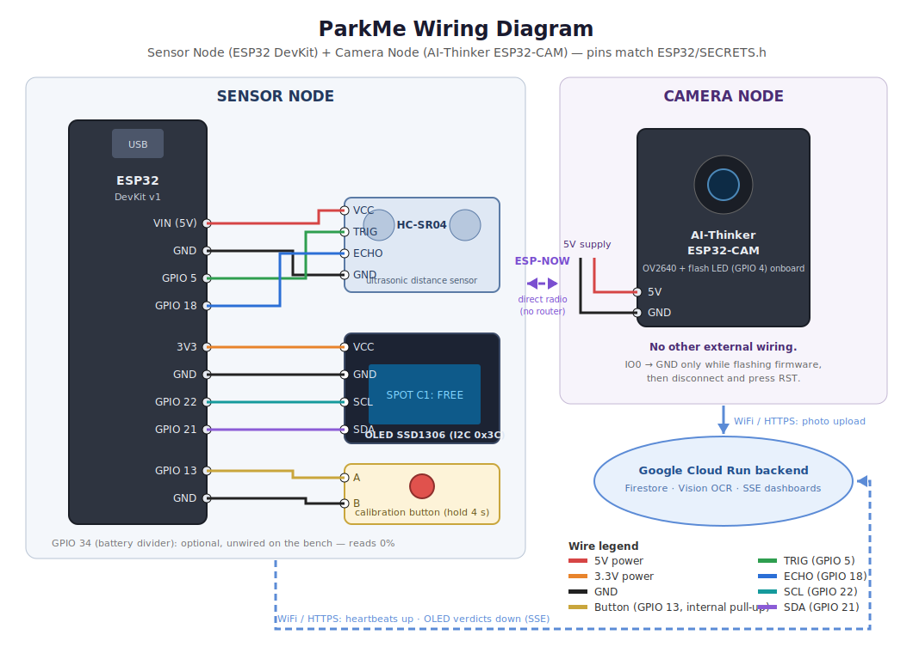
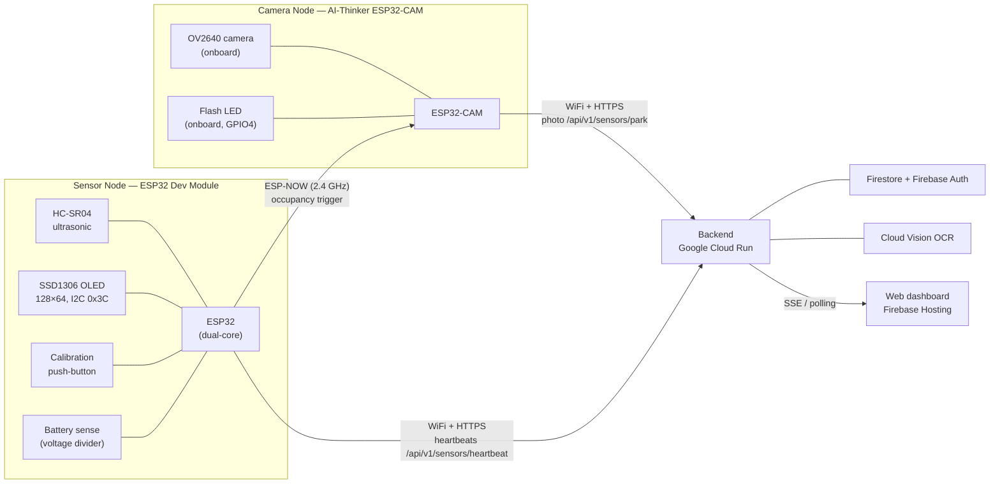

# ParkMe — Hardware Wiring & Connection Diagram

Physical wiring for the two boards of the real spot (C1). All pin numbers come
from the firmware configuration (`ESP32/SECRETS.h`, mirrored in
`ESP32/SECRETS.example.h`) — the firmware is the source of truth.

## Breadboard-style wiring diagram

## System connection overview

## Sensor node — ESP32 Dev Module

| Component | Component pin | ESP32 pin | Notes |
|---|---|---|---|
| HC-SR04 ultrasonic | VCC | 5V (VIN) | HC-SR04 requires 5 V supply |
| HC-SR04 ultrasonic | GND | GND | |
| HC-SR04 ultrasonic | TRIG | GPIO 5 | output from ESP32 |
| HC-SR04 ultrasonic | ECHO | GPIO 18 | input to ESP32 |
| SSD1306 OLED 128×64 | VCC | 3V3 | I2C address `0x3C` |
| SSD1306 OLED 128×64 | GND | GND | |
| SSD1306 OLED 128×64 | SDA | GPIO 21 | default I2C bus |
| SSD1306 OLED 128×64 | SCL | GPIO 22 | |
| Calibration push-button | leg 1 | GPIO 13 | internal pull-up — no resistor needed |
| Calibration push-button | leg 2 | GND | hold 4 s to calibrate trigger distance |
| Battery sense | — not connected — | (GPIO 34 reserved) | firmware supports an optional 2:1 divider battery gauge (3.20–4.20 V); this build is USB-powered, so the reported battery level is 0 % by design |

Power: **USB 5 V from a PC** (no battery in this build); the board's onboard
regulator supplies 3.3 V logic.

## Camera node — AI-Thinker ESP32-CAM

The camera board needs **no external sensor wiring** — it is triggered over
**ESP-NOW** by the sensor node (peer MAC configured in `SECRETS.h`), not by its
own ultrasonic (those config entries exist but are unused by the firmware).

| Component | Connection | Notes |
|---|---|---|
| OV2640 camera | onboard ribbon connector | standard AI-Thinker pin map (PWDN 32, XCLK 0, …) fixed in firmware |
| Flash LED | onboard GPIO 4 | fired automatically during capture |
| Power | 5 V + GND | use a supply able to deliver ≥ 500 mA peaks |
| Flashing (upload) | USB-serial (FTDI): 5V/GND, U0R↔TX, U0T↔RX | hold GPIO 0 → GND during reset to enter flash mode, then release |
| Relay output | disabled (`PARKME_GATE_RELAY_PIN = -1`) | optional gate-opening output, not used in C1 |
| 16×2 I2C LCD | configured (SDA 14 / SCL 15, `0x27`) but **not used** by current firmware | user feedback is shown on the sensor node's OLED instead |

## Board-to-board and board-to-cloud

| Link | Technology | Direction | Purpose |
|---|---|---|---|
| Sensor → Camera | ESP-NOW (connectionless 2.4 GHz, MAC-addressed) | one-way + re-broadcast every 2 s while occupied | "car arrived — take a photo now", works even with WiFi down |
| Sensor → Cloud | WiFi + HTTPS (port 443) | POST heartbeats every 20 s + on state change | occupancy, battery; also polls display commands |
| Camera → Cloud | WiFi + HTTPS (port 443) | POST multipart JPEG | plate photo for OCR + authorization |

Both boards connect to a **phone hotspot** (2.4 GHz) — not the Technion network
(ports blocked). Credentials and the backend host are set in `ESP32/SECRETS.h`
(never committed; see `SECRETS.example.h` for the template).
