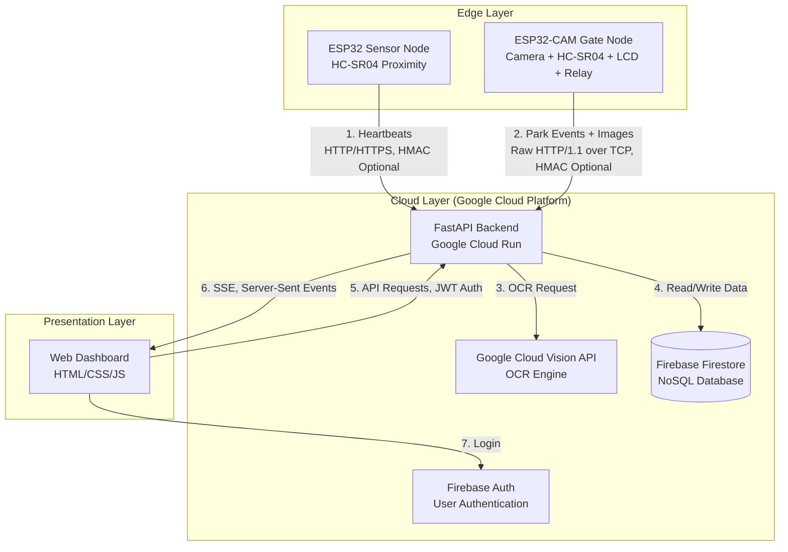

# ParkMe — System Architecture & Workflow

This document provides a high-level overview of how the different components of the ParkMe system communicate and work together to provide a seamless smart parking experience.

---

## 1. System Components

The ParkMe ecosystem consists of four main pillars:

1.  **Hardware (ESP32 Sensors):** The physical IoT edge devices deployed at each parking spot. They detect physical presence and capture images of license plates.
2.  **Backend (FastAPI on Google Cloud Run):** The central brain of the system. It handles business logic, security, image processing (OCR via Google Cloud Vision API), and real-time event broadcasting. Environment variables are loaded from `.env` via `dotenv`.
3.  **Database (Firebase Firestore):** A NoSQL cloud database that stores all persistent data, including users, vehicles, parking spots state, and historical parking logs.
4.  **Frontend (Web App):** The user interface where drivers and administrators can view real-time parking availability and logs. Served via FastAPI's StaticFiles mount at `/`.

---

## 2. Architecture Diagram

---

## 3. Core Workflows

### Scenario A: A Vehicle Parks (The "Park" Event)

1.  **Detection:** The ESP32-CAM gate node detects a vehicle arriving within 50 cm using its HC-SR04 proximity sensor.
2.  **Capture:** The ESP32-CAM turns on the flash LED for 80ms and captures a JPEG snapshot of the vehicle's license plate.
3.  **Transmission:** The ESP32-CAM sends the image to the backend via a `POST /api/v1/sensors/park` request using raw HTTP/1.1 over TCP. The request does **not** currently include HMAC signatures (the backend's HMAC verification is optional and silently passes unsigned requests). The camera retries up to 3 times on failure.
4.  **Processing (OCR):** The backend receives the image and sends it to the **Google Cloud Vision API** for text detection. The Vision API response is parsed to extract the license plate string.
5.  **Validation:** 
    *   The backend queries **Firestore** to find the vehicle associated with that license plate and its owner's role.
    *   It compares the owner's role with the parking spot's allowed category.
6.  **Database Update:** 
    *   A new entry is created in the `parking_logs` Firestore collection. If the user isn't allowed to park there (or is unregistered), it's flagged as a violation.
    *   The `parking_spots` Firestore document is updated to show `is_occupied: true`.
7.  **Response to Hardware:** The backend returns a JSON response with `action` (`"WELCOME"` or `"DENIED"`) and a `message` for the LCD display. If `action` is `"WELCOME"`, the gate node opens the barrier relay for 3 seconds.
8.  **Real-Time Broadcast:** The backend sends a Server-Sent Event (SSE) to all connected Web App clients, immediately updating the UI to show the spot as taken (and triggering an alert if it's a violation). SSE `spot_update` events are filtered by user role; `log_event` events are admin-only.

### Scenario B: Continuous Monitoring (The "Heartbeat")

1.  **Periodic Check-in:** Every 6 minutes, the ESP32 Sensor Node sends a lightweight heartbeat to `POST /api/v1/sensors/heartbeat`. This includes the current physical occupancy and battery level.
2.  **Database Update:** The backend updates the corresponding spot in Firestore with the latest `last_seen` timestamp, battery level, and physical occupancy.
3.  **Anomaly Detection:** 
    *   **Ghost Car:** If the heartbeat says "occupied" but there is no active log (maybe the camera failed to capture the plate), the backend creates an "UNIDENTIFIED" log and flags a violation.
    *   **Bouncing Driver:** If a car leaves within 60 seconds of arriving, the backend intercepts the departure and marks the log as "ABORTED" with `is_violation = False`, canceling any potential violation.
4.  **Offline Resilience:** If the Sensor Node cannot reach the server, it caches the telemetry data in NVS (non-volatile storage) and flushes it automatically once connectivity is restored.
5.  **Real-Time Broadcast:** Any changes in state are broadcasted via SSE to the web frontend.

### Scenario C: Web Frontend Usage

1.  **Login:** A user logs into the Web App. The frontend authenticates directly against Firebase Auth and retrieves a Firebase ID token.
2.  **Initial Load:** The frontend fetches the user's role/profile from `GET /api/v1/users/me` and the spot statuses from `GET /api/v1/spots` (sending the Firebase ID token in the Authorization header). The backend fetches the current state of all spots from Firestore, filtering them based on the user's role (e.g., an admin sees everything, a student only sees student spots).
3.  **Live Updates:** The frontend opens a persistent connection to `GET /api/v1/stream`. It listens for SSE events. When a car parks or leaves, the backend pushes the update down this stream, and the frontend updates the map/list without needing to refresh the page. `spot_update` events are filtered by the user's role; `log_event` events are only sent to admin users.
4.  **Admin Resolution:** If an admin sees an "UNIDENTIFIED" car, they can manually inspect it. To prevent race conditions during camera failures, the UI enforces a **45-second freeze/countdown** on the "Resolve" button to allow the Camera Node to finish its network retries. Once unlocked, the admin can click it to call `PUT /api/v1/sensors/resolve`. The backend updates the Firestore log to "RESOLVED" and clears the violation.

---

## 4. Security & Authentication

*   **Device-to-Cloud (ESP32 to Backend):** The backend includes an **optional HMAC-SHA256 verification** mechanism. The `verify_hmac_signature()` function checks for `X-Signature` and `X-Timestamp` headers — if they are present, it validates the signature against the shared secret (`ESP32_HMAC_SECRET`) and rejects requests older than 30 seconds to prevent replay attacks. However, if the headers are **absent**, the function silently passes the request through without verification. **Currently, neither the Sensor Node nor the Camera Node sends HMAC headers**, meaning all device requests are effectively unsigned. This is a **known security gap** planned for future hardening. Communication from the Camera Node uses raw HTTP/1.1 over TCP.
*   **User-to-Cloud (Web App to Backend):** Uses **Firebase ID Tokens (JWT)**. When a user logs in via the client, they receive a secure token signed by Google. They send this token in the `Authorization` header for subsequent requests. The backend verifies it via the Firebase Admin SDK and retrieves user properties (like roles) from Firestore to enforce role-based access control (RBAC).
*   **Cloud-to-Database (Backend to Firestore):** Uses **Google Application Default Credentials (ADC)** via the `serviceAccountKey.json`. This provides secure server-to-server authentication within Google's infrastructure.
