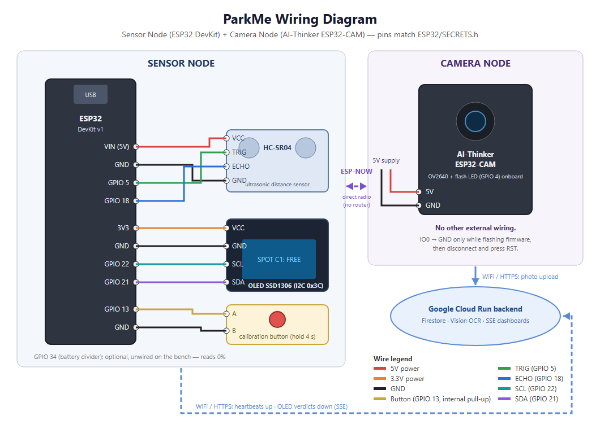
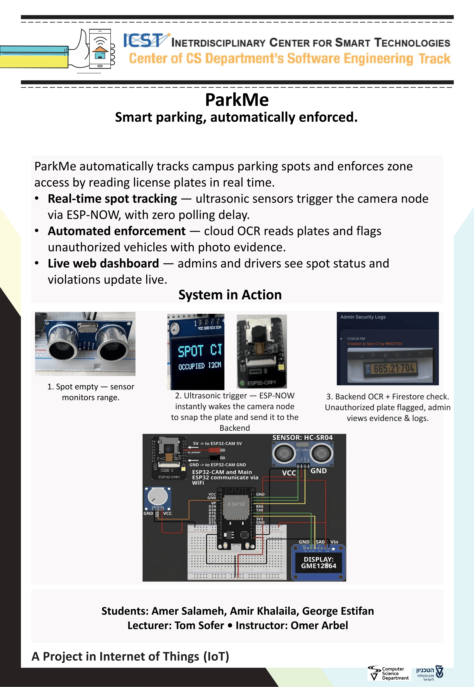

# ParkMe

ParkMe is a smart parking system for reserved campus spots. Each spot has two
ESP32 boards — an ultrasonic **sensor node** that detects the car and drives a
driver-facing screen, and an **ESP32-CAM camera node** that photographs the
licence plate. The moment a car parks, the sensor triggers the camera directly
over **ESP-NOW**; the camera uploads the photo over HTTPS to a **FastAPI backend
on Google Cloud Run**, which runs **Google Cloud Vision** OCR, checks the plate
owner's role against the spot's category in **Firestore**, and pushes the verdict
live to the driver's screen and to a **web dashboard** over SSE.

## Team

- Amer Salameh
- George Estifan
- Amir Khalaila

Part of ICST — The Interdisciplinary Center for Smart Technologies, Taub Faculty
of Computer Science, Technion.

## Architecture (current production)

- ESP32 sensor and camera nodes at the edge (ESP-NOW between them)
- FastAPI backend on Google Cloud Run
- Firebase Firestore for application data
- Firebase Authentication for web login
- Google Cloud Vision API for licence-plate OCR
- Firebase Hosting for the static dashboard

## Repository Layout

- `Backend/` — FastAPI backend, Firestore seed scripts, multi-spot simulator (`simulate_spots.py`), Dockerfile, and Cloud Build deployment config
- `Frontend/` — HTML/CSS/JS dashboard (Firebase Hosting)
- `ESP32/` — sensor firmware (`ParkMeSensorNode/`), camera firmware (`ParkMeCameraNode/`), shared libraries, `parameters.h` (hard-coded parameter reference), and `SECRETS.example.h` (secrets template)
- `Unit Tests/` — standalone hardware validation sketches (`HW_*`) and Python unit/integration tests + real-image LPR pipeline (`vision_api_tests/`)
- `Documentation/` — all project docs; start at [`Documentation/README.md`](Documentation/README.md)

## Hardware Used (per parking spot — quantities for the one built spot, C1)

| Qty | Component | Role |
|-----|-----------|------|
| 1 | ESP32 Dev Module (dev board) | Sensor node — ultrasonic sensing, OLED, ESP-NOW, WiFi |
| 1 | AI-Thinker ESP32-CAM (with OV2640 camera) | Camera node — plate photo, ESP-NOW, WiFi |
| 1 | HC-SR04 ultrasonic distance sensor | Detects a car in the spot |
| 1 | SSD1306 OLED display, 128×64, I2C | Driver-facing screen (WELCOME / DENIED / review) |
| 1 | Momentary push-button | Calibration (hold 4 s to set trigger distance) |
| 1 | USB-to-serial (FTDI) adapter | Flashing the ESP32-CAM (no onboard USB) |
| ~10 | Jumper wires (M-M / M-F) | Sensor-node wiring |
| 1 | Breadboard | Prototyping the sensor node |
| 2 | USB cables / 5 V supply | Powering the two boards |

Not used in this build (firmware has config entries but they are disabled): a
16×2 I2C LCD and a gate relay.

## Wiring Diagram

Full pin tables, power notes, and the editable source are in
[`Documentation/HARDWARE_WIRING.md`](Documentation/HARDWARE_WIRING.md)
(diagram source: [`Documentation/images/wiring_diagram.svg`](Documentation/images/wiring_diagram.svg)).
All pin numbers come from the firmware configuration in `ESP32/SECRETS.example.h`.

## Software Versions (libraries & SDKs)

Exact library names and versions used with the ESP32 and the backend are in
[`Documentation/VERSIONS.md`](Documentation/VERSIONS.md). In short: the firmware
uses only libraries bundled with the **Arduino ESP32 core** (WiFi, HTTPClient,
Wire, Preferences, esp_now, esp_camera) — no external Arduino libraries — and the
backend runs on **Python 3.11** with FastAPI, firebase-admin, and
google-cloud-vision (pinned versions in the doc).

## Poster

## Configuration files

- **Parameters (hard-coded):** [`ESP32/parameters.h`](ESP32/parameters.h) describes every compile-time parameter (pins, thresholds, timings) and what it does. The values are set in `SECRETS.h`.
- **Secrets (template):** [`ESP32/SECRETS.example.h`](ESP32/SECRETS.example.h) is committed as a fill-in template. The real `ESP32/SECRETS.h` (WiFi credentials, backend host) is **git-ignored** and never committed.

## Documentation

Start at [`Documentation/README.md`](Documentation/README.md) — the index. Highlights:
- [`SYSTEM_EXPLAINED.md`](Documentation/SYSTEM_EXPLAINED.md) — full technical deep dive (ESP-NOW rationale, dual-core firmware, calibration, WiFi-loss handling)
- [`ESP32/hardware-upload-guide.md`](ESP32/hardware-upload-guide.md) — configure `SECRETS.h` and flash both boards

### Calibration (does the project need calibration?)

Yes — the sensor's trigger distance is calibrated by demonstration: place an
object at the desired trigger distance (3–50 cm) and hold the calibration button
for 4 seconds. The value is stored in flash and survives reboots. Full procedure
in [`ESP32/README.md`](ESP32/README.md).

## Security Notes

- Never commit `ESP32/SECRETS.h` (keep only `SECRETS.example.h`), `serviceAccountKey.json`, or `.env` files — all are git-ignored.
- Cloud/Firebase provisioning is done manually through the team-owned Google account.
