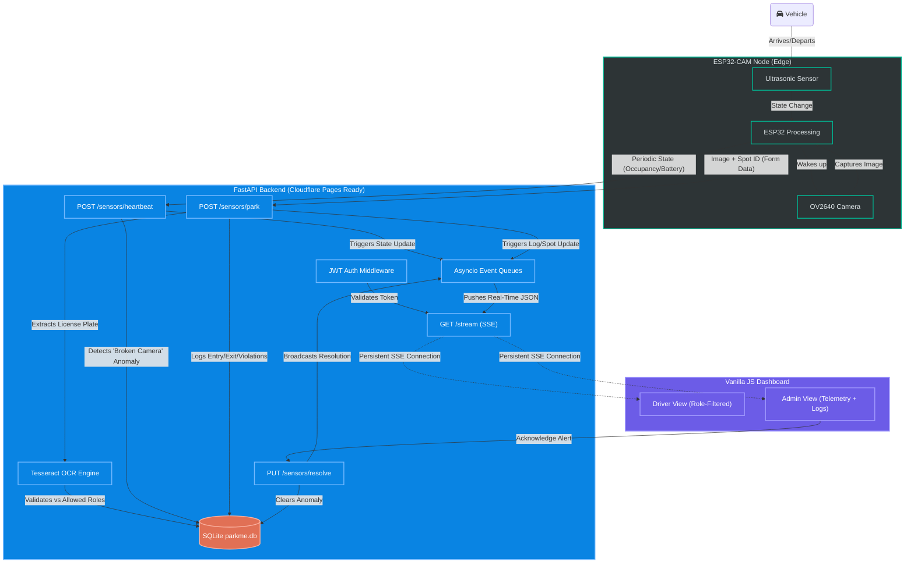

# Phase 8: Final System Architecture

This document visualizes the complete, production-ready architecture of the ParkMe system, reflecting all the pivots and upgrades we implemented (Edge Sensor Fusion, Server-Sent Events, JWT Role-Based Access Control, and the Vanilla JS Dashboard).

### Key Architectural Highlights
1. **Edge Sensor Fusion**: The ESP32 acts as the authoritative source of truth. It manages the camera wake-cycle locally, drastically reducing network overhead.
2. **"Broken Camera" Healing**: The `/sensors/heartbeat` endpoint actively cross-references the physical occupancy state against the OCR logs. If a car is physically present but the camera failed to capture a plate, the backend automatically flags it as `UNIDENTIFIED`.
3. **SSE Broadcaster**: Instead of the frontend polling the database, the FastAPI backend maintains an array of `asyncio` queues. Database modifications instantly trigger an `await broadcast_event`, piping the JSON down the active HTTP streams.
4. **Strict RBAC**: The `/stream` and `/spots` endpoints cryptographically verify the JWT. Standard drivers are mathematically shielded from receiving JSON payloads belonging to administrative or mismatched spots.
