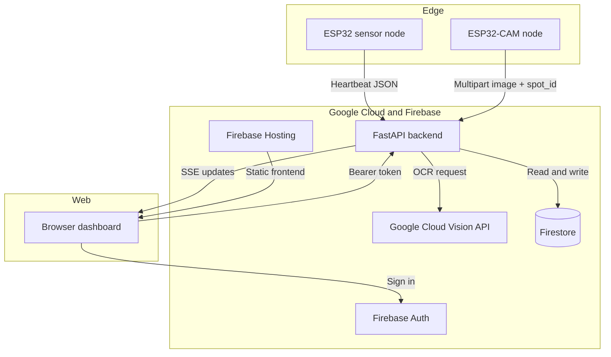

# ParkMe System Architecture and Workflow

This document describes the current repository architecture after the migration to Google Cloud and Firebase.

## 1. Main Components

ParkMe is made of six cooperating parts:

1. `ESP32` sensor nodes
   - Detect occupancy with ultrasonic sensors
   - Send heartbeats with MAC address, occupancy state, and battery level
2. `ESP32-CAM` gate/camera nodes
   - Capture an image when a vehicle arrives
   - Upload the image and spot identifier to the backend
3. FastAPI backend
   - Runs the API
   - Verifies Firebase ID tokens
   - Reads and writes Firestore
   - Calls Google Cloud Vision for OCR
   - Broadcasts live updates over Server-Sent Events
4. Firebase Firestore
   - Stores users, vehicles, parking spots, and parking logs
5. Firebase Authentication
   - Authenticates dashboard users with email/password
6. Frontend
   - Static HTML/CSS/JS dashboard
   - Can be served by the backend or deployed through Firebase Hosting

## 2. High-Level Diagram

## 3. Current Backend Workflows

### Sensor heartbeat flow

1. The sensor posts to `POST /api/v1/sensors/heartbeat`.
2. The payload contains:
   - `mac_address`
   - `is_occupied`
   - `battery_level`
3. The backend finds the matching Firestore parking spot by `mac_address`.
4. It updates:
   - `last_seen`
   - `battery_level`
   - `is_occupied`
5. If the spot becomes occupied without an active parking log, the backend creates an `UNIDENTIFIED` log.
6. If the spot becomes free and the active session is very short, the backend marks it as `ABORTED`.
7. Any queued sensor telemetry is flushed once connectivity returns.
8. The backend pushes an SSE `spot_update` event to connected dashboards.

### Camera parking flow

1. The camera posts to `POST /api/v1/sensors/park`.
2. The request contains:
   - `spot_id`
   - `file`
3. The backend sends the image bytes to Google Cloud Vision.
4. OCR extracts digits from the detected text.
5. The backend:
   - looks up the parking spot in Firestore
   - looks up the vehicle by license plate
   - looks up the matching user profile
   - decides whether the parking event is allowed
6. A new `parking_logs` document is created, or a stale `UNIDENTIFIED` log is self-healed if the camera succeeds after the heartbeat already created a ghost log.
7. The spot is marked occupied and the dashboard receives live updates.
8. The backend returns a gate decision payload with `action` and `message` for the LCD and relay behavior.

### Web dashboard flow

1. The frontend signs in through Firebase Authentication.
2. Firebase returns an ID token to the browser.
3. The frontend sends that token to the backend as `Authorization: Bearer ...`.
4. The backend verifies the token with Firebase Admin SDK.
5. The backend looks up the matching user profile in Firestore by email.
6. The frontend loads:
   - `GET /api/v1/users/me`
   - `GET /api/v1/spots`
   - `GET /api/v1/logs` for admins
7. The frontend opens `GET /api/v1/stream?token=...` for live updates.
8. Admin users can acknowledge unresolved `UNIDENTIFIED` events after the frontend retry cooldown finishes.

## 4. Platform Changes from the Pre-Migration Version

The repo no longer uses the original Render + SQL stack.

Current platform choices:

- Backend runtime: Google Cloud Run
- Database: Firebase Firestore
- Web authentication: Firebase Authentication
- OCR provider: Google Cloud Vision API
- Static hosting: Firebase Hosting

Removed platform assumptions:

- Render deployment config
- SQL schema and SQL seed files
- OpenCV/Tesseract OCR pipeline
- Custom backend login endpoint

## 5. Security Model

### Web auth

- The frontend authenticates with Firebase Auth.
- The backend verifies Firebase ID tokens before serving protected routes.
- User role and profile data are stored in Firestore.

### Backend-to-Google auth

- Local development uses `GOOGLE_APPLICATION_CREDENTIALS` with a downloaded service-account JSON file.
- Cloud Run uses Application Default Credentials from the runtime service account.

### Device auth

- The backend includes HMAC verification support for ESP32 requests.
- The same `ESP32_HMAC_SECRET` should be configured on backend and firmware before production use.
- The current code path allows unsigned requests when those headers are omitted, so hardening that production path is still a follow-up task.

## 6. Important Integration Notes

- Firestore spot IDs in the seeded data are string IDs such as `A1`, `A2`, `B1`, and `C2`.
- Heartbeats are matched by `parking_spots.mac_address`, not by the numeric sensor label in firmware.
- The frontend still needs the final deployed Cloud Run URL in `Frontend/app.js` for production use.
- The firmware still needs a local `ESP32/SECRETS.h` file with Wi-Fi and backend host values.
- Firebase Auth users must exist in Firebase Authentication and have matching emails in Firestore.
